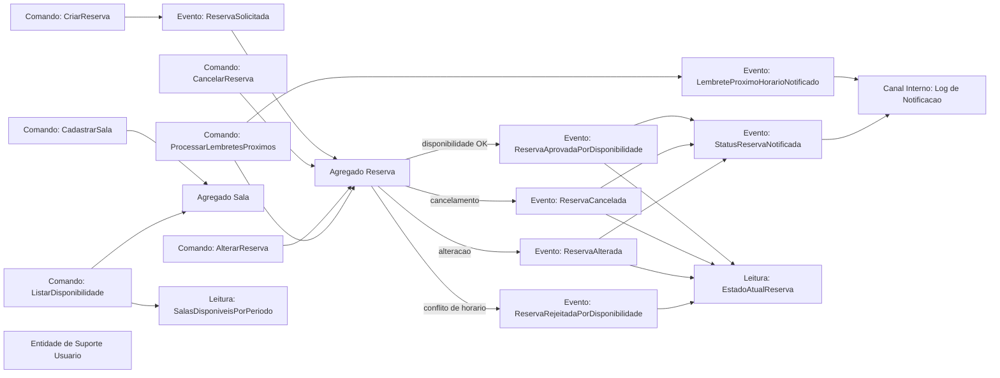

# Event Storming — SalaLivre

## Visão Geral
O fluxo do SalaLivre foi modelado para cobrir reserva de salas, decisão por disponibilidade, gestão de alterações/cancelamentos e notificações automáticas. Para fins acadêmicos, a identificação do solicitante na API é simulada por headers (`X-User-Id` e `X-User-Role`) e as notificações são registradas em log.

## Comandos
- **CadastrarSala**
- **CriarReserva**
- **CancelarReserva**
- **AlterarReserva**
- **ListarDisponibilidade**
- **ProcessarLembretesProximos**

## Eventos
- **ReservaSolicitada** (evento de negócio do processo, antes da decisão)
- **ReservaAprovadaPorDisponibilidade** (implementado como `ReservaCriada`)
- **ReservaRejeitadaPorDisponibilidade** (implementado como erro de conflito de horário)
- **ReservaCancelada**
- **ReservaAlterada**
- **StatusReservaNotificada** (confirmada/cancelada/alterada)
- **LembreteProximoHorarioNotificado**

## Agregados e Regras
- **Sala (Agregado)**: id, nome, capacidade, localização, recursos, ativa.
- **Reserva (Agregado)**: id, salaId, usuarioId, periodo, status, criadoEm, atualizadoEm.
- **Usuário (Entidade de Suporte)**: id, nome, email, tipo.
- Regras principais:
  - `fim > inicio`.
  - conflito: `inicio < existente.fim` e `fim > existente.inicio`.
  - reservas canceladas não entram no conflito.
  - usuário comum só altera/cancela a própria reserva; admin pode gerir reservas.
  - sala inativa não pode receber nova reserva/alteração.

## Diagrama de Event Storming

## Mapeamento para Implementação
- **CadastrarSala**:
  - Endpoint: `POST /api/v1/salas`
  - Aplicação: `SalaAppService.cadastrarSala`
- **CriarReserva**:
  - Endpoint: `POST /api/v1/reservas`
  - Aplicação: `ReservaAppService.criarReserva`
  - Evento efetivo: `ReservaCriadaEvent` (equivale à aprovação por disponibilidade)
  - Rejeição por disponibilidade: `ConflitoDeHorarioException` (HTTP 409)
- **CancelarReserva**:
  - Endpoint: `PATCH /api/v1/reservas/{id}/cancelar`
  - Aplicação: `ReservaAppService.cancelarReserva`
  - Evento: `ReservaCanceladaEvent`
- **AlterarReserva**:
  - Endpoint: `PATCH /api/v1/reservas/{id}/alterar`
  - Aplicação: `ReservaAppService.alterarReserva`
  - Evento: `ReservaAlteradaEvent`
- **ListarDisponibilidade**:
  - Endpoint: `GET /api/v1/disponibilidade`
  - Aplicação: `DisponibilidadeAppService.listarSalasDisponiveis`
- **Notificação de status e lembrete próximo**:
  - Serviço: `NotificacaoService` (registro em log para simulação acadêmica)
  - Scheduler: `LembreteReservaScheduler` + evento `ReservaLembreteEvent`
- **Decisão acadêmica de autorização**:
  - Headers `X-User-Id` e `X-User-Role` simulam identidade/perfil na API de reservas.
